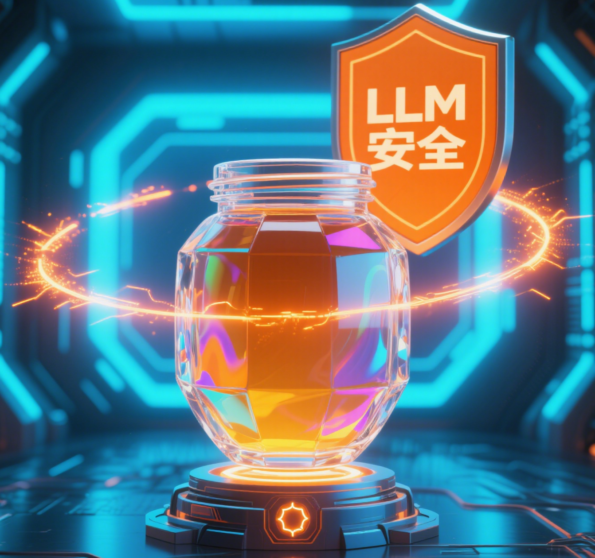

  

<h1 align="center">我是Qianli Wang👋 欢迎来到我的个人主页！主页网站：https://3089464667.github.io/QIANLI-WANG.github.io/</h1>

  
  
  
  

---

## 🧑‍💻 个人简介

> 你好！我是Qianli Wang，专注于大语言模型（LLM）与蜜罐（Honeypot）安全技术的研究者。热爱人工智能、网络安全与前沿技术，致力于用技术守护数字世界。

---

  

---

  

---

## 🚀 项目介绍

| 项目名称         | 简介                                                         | 技术栈         |
|------------------|-------------------------------------------------------------|----------------|
| LLM Playground   | 大语言模型实验平台，支持多模型对比与推理                    | Python, FastAPI |
| 智能蜜罐系统     | 高交互蜜罐，自动化捕获与分析攻击行为                        | Python, Docker  |
| 安全数据可视化   | 攻击溯源与威胁情报可视化平台                                | React, ECharts         |

---

## 🛠️ 技能清单

- **编程语言**：Python、JavaScript、Shell
- **AI/LLM**：PyTorch、Transformers、LangChain
- **安全技术**：蜜罐部署、入侵检测、日志分析
- **容器**：Docker
- **前端开发**：React、ECharts
- **数据分析**：Pandas

---

### 🖥️ 语言和框架

  
  
  
  
  
  
  
  
  
  
  
  
  
  
  
  
  
  
  
  
  

---

## 🌟 研究方向

- **大语言模型（LLM）安全性与应用**
- **蜜罐技术与自动化攻击分析**
- **AI驱动的威胁检测与响应**

  

---

## 📫 联系方式

- 邮箱：heimagogo6@163.com
- GitHub：[QIANLI-WANG](https://github.com/3089464667)
- douyin、B station、small red book：knowledge-share
---

> “安全是人工智能的基石，创新是网络世界的未来。”

---

  

